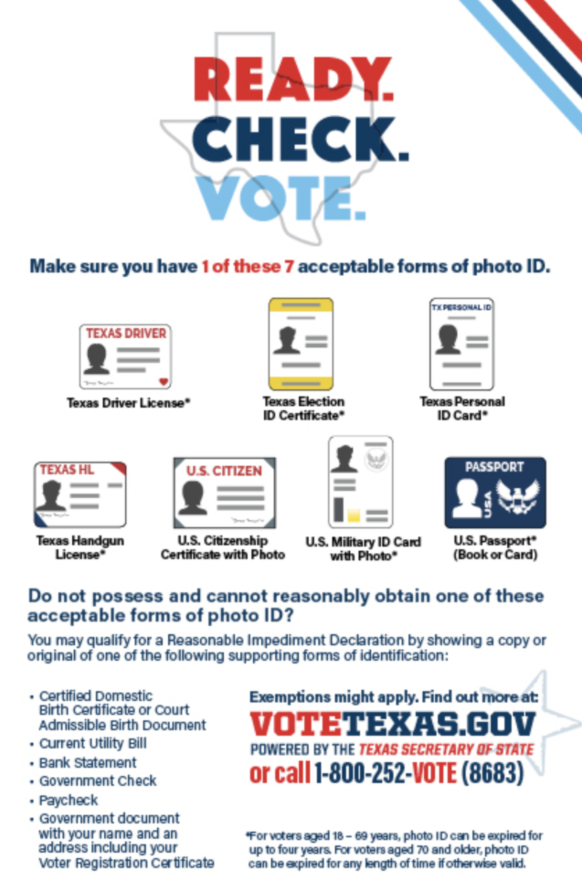
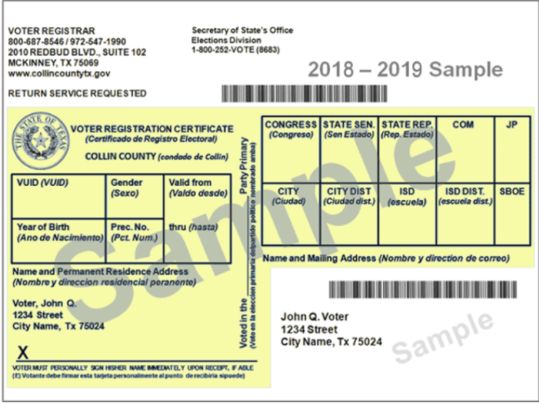

## What clothing is allowed and not allowed to be worn? 
Wearing T-shirts, buttons or hats supporting political candidates at the polls is illegal. 
  - For example, a "Make America Great Again" hat or Joe Biden button would count as electioneering, a Black Lives Matter or “Don’t tread on me” message would.

## Can I vote in person if I already have a mail-in ballot? 
The short answer is yes. The process will be more streamlined if you bring your mail-in ballot with you to your polling place so you can surrender it before casting your vote. If you don’t have your ballot or never received it, you can still cast a provisional ballot. Your vote will be counted once the county determines it never received your mail-in ballot.

## Can I track my mail-in ballot or in person ballot?
Yes, you can track your ballot [here](https://www.txballot.org/).

## Can I vote if I have COVID-19?
Yes. If you have been diagnosed with COVID-19 or are exhibiting symptoms, consider requesting an emergency mail-in ballot or using curbside voting. Contact [your county elections office](https://www.sos.state.tx.us/elections/voter/votregduties.shtml) for more details about both options.

## How do I know if I am registered to vote? 
You can check your Texas registration status [here](https://teamrv-mvp.sos.texas.gov/MVP/mvp.do).

## How do I register to vote? 
To register to vote in Texas, simply complete a voter registration application and return it to your county election office at least 30 days before the upcoming election date.
 

To complete an application, you may:

* Use the [SOS ONLINE VOTER REGISTRATION APPLICATION](https://vrapp.sos.state.tx.us/index.asp).
  * Simply fill in the required information, print, sign and mail directly to your county election office.
* Contact or visit your local [VOTER REGISTRAR](https://www.sos.state.tx.us/elections/voter/votregduties.shtml) to complete the voter registration process.

## I am a student, can I register to vote at my school address?
YES! You have the right to register to vote at your school address – this includes a dorm room. Any student living in a dorm is entitled to the same rights as any other student. To imply otherwise is illegal. If you receive mail in a Post Office box you can sign an affidavit (or, in some cases, get a letter from your college’s Residential Life office) asserting that you live at your dorm address.

## Am I required to vote for everything on the ballot?
No! You don’t have to answer everything. 

## What if I go to the polls and they tell me I am not registered to vote? 
First, make sure you are at the right polling place. If you are at the wrong polling place they will not have your name on the list of voters. If you are at the correct location and are not on the list, you can still cast a ballot. Ask the poll worker for a provisional ballot. After the polls close on Election Day the state will check on the status of your voter registration and if there was a mistake made. The state must notify you as to whether your ballot was counted. 

## What do I need to vote? 

## What do I do if I moved? 
**1. Did you move within your county?**
  - If you moved from one place to another in the same county, you’ll need to notify the [Voter Registrar](http://www.sos.state.tx.us/elections/voter/votregduties.shtml) in your county in writing of your new address. (In most Texas counties, the Tax Assessor-Collector is also the Voter Registrar. In some counties, the [County Clerk or Elections Administrator](http://www.sos.state.tx.us/elections/voter/current.shtml) registers voters.) 

There are several ways to do this:
  
* Correct your current voter registration certificate on the back and return it to the [Voter Registrar](http://www.sos.state.tx.us/elections/voter/votregduties.shtml).
* Fill out a new voter registration application form and check the “change” box.
* When you apply for or change your Texas driver’s license, change your voter information at the same time.
* As long as you reside in the same county, you can change your information online at the [Secretary of State’s Voter Registration Name/Address Change](https://txapps.texas.gov/tolapp/sos/SOSACManager) website. 
  * The screen will prompt you through the process and the changes that you make will be forwarded to your county [Voter Registrar](http://www.sos.state.tx.us/elections/voter/votregduties.shtml) for processing. You will be mailed a new certificate with your new address and be able to vote in your new precinct 30 days after you submitted your change. If you miss the 30-day deadline to change information on your voter registration certificate, you may vote in your former precinct as long as you still reside in the political subdivision conducting the election.

**2. Did you move to another county?**
* If you moved to another county, YOU MUST RE-REGISTER! Fill out and mail a new application, or take it in person, to the [Voter Registrar](http://www.sos.state.tx.us/elections/voter/votregduties.shtml) of your new county. (In most Texas counties, the Tax Assessor-Collector is also the Voter Registrar. In some counties, the [County Clerk or Elections Administrator](http://www.sos.state.tx.us/elections/voter/current.shtml) registers voters.) You will receive a new voter registration certificate 30 days after your application is submitted and accepted.
* If you are late to register in your new county, you may be able to vote a “limited” ballot on candidates or issues common between your old and new counties. You may only vote this “limited” ballot after you have moved to your new residence, during the early voting period by personal appearance at the main early voting polling place (not on Election Day) or by mail (if otherwise qualified to vote by mail) and if:
  * You are a current registered voter in your former county;
  * You would be eligible to vote in your former county on Election Day, if you were still living in that county;
  * You have not re-registered in the new county, or, if you have re-registered, the effective date of the new registration will not be effective on or before Election day.
  * If you feel you qualify to vote a limited ballot, we recommend that you contact the office of the [Early Voting Clerk](http://www.sos.state.tx.us/elections/voter/county.shtml) in your new county.
    
## What is a voter registration card? 
1. After you apply, a voter registration certificate (your proof of registration) will be mailed to you within 30 days.
2. Check your certificate to be sure all information is correct. If there is a mistake, make corrections and return it to the [Voter Registrar](https://www.sos.state.tx.us/elections/voter/votregduties.shtml) immediately.
3. On your registration certificate, you will see a precinct number. Your residence is located in a specific “precinct,” or area within the county where you will vote on Election Day. In some cases, precincts may be combined to accommodate joint local elections, so always consult your [County Clerk or Elections Administrator](https://www.sos.state.tx.us/elections/voter/current.shtml) in the days before an election for the address of the polling place where you’re to vote. If your county has supplied us with polling place information, you can find that information here: [County Precincts and Polling Place Addresses](https://teamrv-mvp.sos.texas.gov/MVP/mvp.do)
4. When you go to the polls to vote, present one of the seven (7) acceptable forms of [photo ID](https://www.votetexas.gov/register-to-vote/need-id.html). If you do not possess an acceptable form of photo identification and cannot reasonably obtain one, you may present a [supporting form of ID](https://www.votetexas.gov/register-to-vote/need-id.html) (one of which is your valid voter registration certificate) and execute a Reasonable Impediment Declaration, noting your reasonable impediment to obtaining an acceptable form of photo identification, stating that the information contained in the declaration is true, that you are the same individual personally appearing at the polling place to sign the declaration, and that you face a reasonable impediment to procuring an acceptable form of photo identification. An election official will match your name to the official list of registered voters.
5. For voters that applied for and received the permanent exemption from showing a photo ID based in their disability status, this status will be notated on their voter registration certificate. These voters are required to present their voter registration certificate when they go to the polls to vote.
6. If you lose your certificate, notify your county [Voter Registrar](https://www.sos.state.tx.us/elections/voter/votregduties.shtml) in writing to receive a new one.
7. You will automatically receive a new certificate every two years if you haven’t moved from the address at which you are registered.
* 

## Are phones allowed in polling places? 
People are not allowed to use wireless communications devices within 100 feet of the voting stations. Additionally, people are not allowed to use mechanical or electronic devices to record sound or images within 100 feet of the voting stations. Tex. Elec. Code §§ 61.014(a), 81.002.

## What devices should not be used in the polling place?
1. Cell phones
2. Cameras
3. Tablet computers
4. Laptop computers
5. Sound recorders
6. Any other device that may communicate wirelessly, or be used to record sound or images.

## More information about phones in polling places? 
**What about voters with disabilities?**
* In recent years, advances in technology have enabled cell phones, tablets and other wireless communications devices to assist voters with disabilities. 
  * As an example, a voter may use a program/application on a cell phone to translate verbal communication into sign language, allowing the voter to understand communication by an election official.  While this situation is not expressly addressed in the Election Code, an election judge or early voting clerk may use their authority to allow a voter to utilize these programs/applications at their discretion. If you have any questions, please contact our office.
  
**What about poll watchers, may they use these devices?**
* No. A poll watcher may not be accepted for service if the poll watcher has possession of a device capable of recording images or sound unless the poll watcher agrees to disable or deactivate the device. The early voting clerk or presiding judge, as appropriate, may inquire whether a poll watcher has possession of any prohibited recording devices before accepting the poll watcher for service. The poll watcher must sign an oath stating he or she does not have in his or her possession devices capable of recording images or sound, or that he or she will disable or deactivate the devices while serving as a watcher. Tex. Elec. Code §§ 33.006, et. seq.
  
**What about election officials, may they use these devices?** 
* Yes, if they are using the device to conduct official duties.
  
**What if the polling location is also a business location where a person may be employed and needing to use a wireless communication device for employment related matters?**
* This is permissible if the person is acting in the course of the person’s employment.
  
**What if a person enters the 100-foot area while using a wireless communications device or appearing to record sound/image?**
* The early voting clerk and the presiding judge have the authority to require persons to deactivate any such devices and further authority to require persons who do not comply to leave the early voting or election day polling place, as appropriate. 
* Questions or clarification should be directed to the early voting clerk or the presiding judge in your polling place, as appropriate.

**How should voters be notified of this law?**
* A notice may be posted at the polling place by the early voting clerk or presiding judge. The notice should be posted where it can be read by persons waiting to vote. Our office has prescribed the wording of such a posted notice: [Notice of Certain Devices Within 100 Feet of Voting Station](https://www.sos.state.tx.us/elections/forms/pol-sub/7-9f.pdf). (PDF). 
* If other wording is used, it will need to be approved by our office prior to use.
