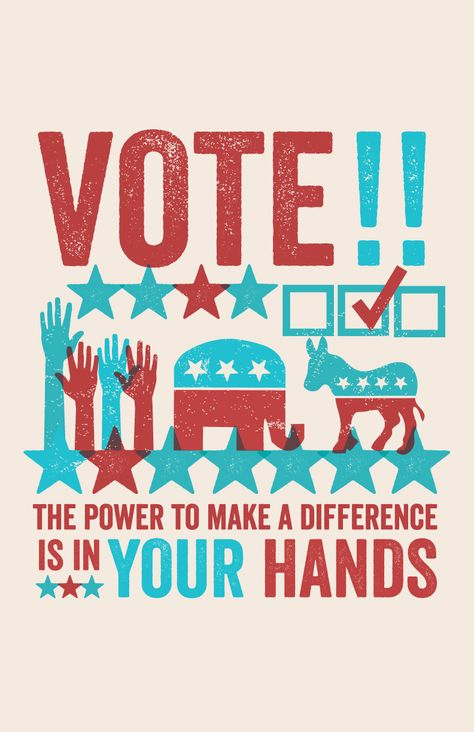

## What are alternatives to in-person voting? 
The State of Texas at the moment has not implemented specific or expanded methods of voting in response to the global pandemic. Instead, here are two safety-conscious options for elibgible voters. 
 
1. **`Mail-in Voting`**: If you have a disability, are over the age of 65, will be out of the county for early voting and election day, or are confined in jail (but otherwise eligible), you can apply to vote by mail. An election clerk _cannot_ question you about your qualifications to vote. Learn how to apply [here](https://www.sos.texas.gov/elections/voter/reqabbm.shtml).
2. **`Curbside Voting`**: If you are physically unable to enter the polling place or have symptons of COVID-19, you can request for a ballot to be brought to your car at the curb. An election clerk _cannot_ question you about your physical inability to enter a polling place. You do not have to apply for benefit; simply call your polling place. 

## What safety measures are recommended for in-person voting?
1. **`Wash your hands`**: After you finish voting and leave the polling station, immediately wash your hands for 20 seconds or use a sanitizer with at least 60% alcohol until you can wash your hands.
2. **`Stay 6 feet apart`**: Try to distance yourself by 6 feet from other voters or election clerks. 
3. **`Wear protective gear`**: Wear a mask that covers your nose and mouth. The most effective masks include surgical, cloth, or N95. Avoid wearing a bandana or neck gaiter as these materials are less effective. Consider wearing a face sheild or goggles to protect your eyes from droplets. Lastly, consider wearing gloves while in the polling place and disposing of them once you can safely wash or sanitize your hands. 
4. **`Do not touch your face`**: Avoid touch your face to prevent the spread of the virus. 

For more information visit [Center for Disease Control](https://www.cdc.gov/coronavirus/2019-ncov/your-health/need-to-know.html).
 

## Do I have to wear a mask to vote? 
It depends on your county or local government. If they have a mask requirement in place, you must wear a mask at a polling place. However, Texas does not require masks at polling places; it is instead highly encouraged. Your mask cannot have affiliated parties or candidates shown. 
 

## Do I have to remove my mask at the request of an election clerk?
Yes. Election clerks can request a voter to temporarily remove their face covering solely for verifying a voter's identity. If you refuse to remove your face mask, an election clerk _must_ provide a provisional ballot. A provisional ballot does not count as a vote until any voting deficiencies resolve with the county's voter registrar. 
  

## What if I have COVID or COVID related symptoms? 
We recommend those with COVID or experiencing COVID related symptoms participate in mail-in voting. However, suppose you cannot apply to vote by mail. In that case, there are other alternatives like requesting curbside voting, priority voting (i.e., skipping the line when voting in-person), or in-person voting with a face mask. An election clerk _cannot_ prevent you from voting. _We recommend those with COVID symptoms opt for curbside voting to limit exposure to in-person voters._

